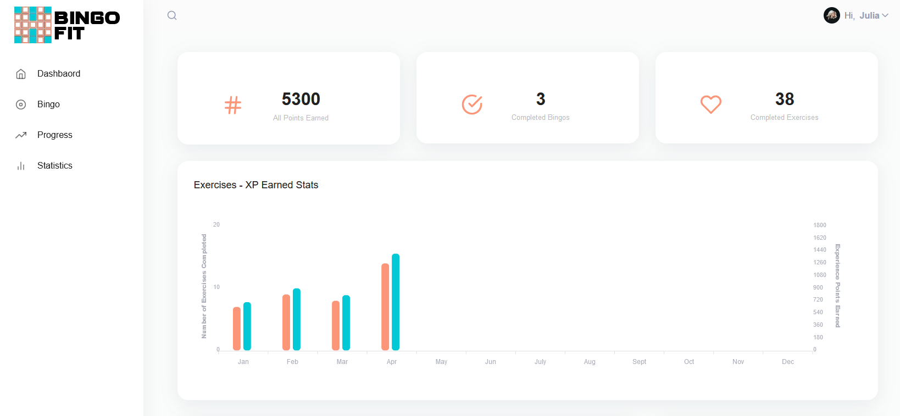
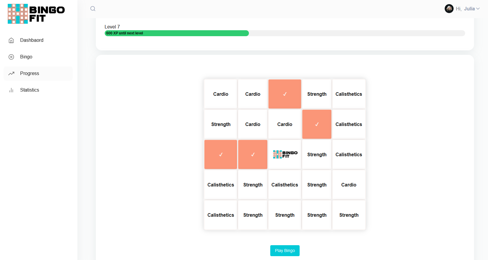
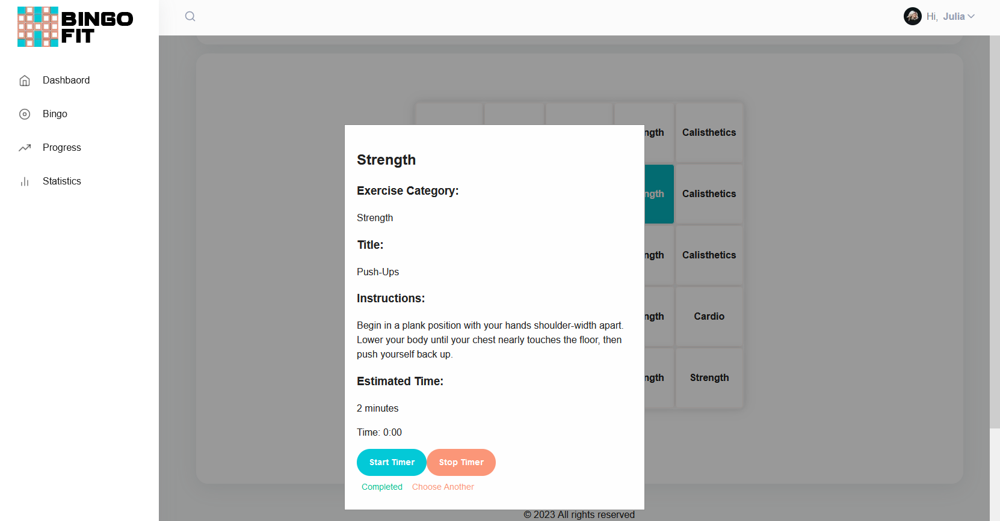
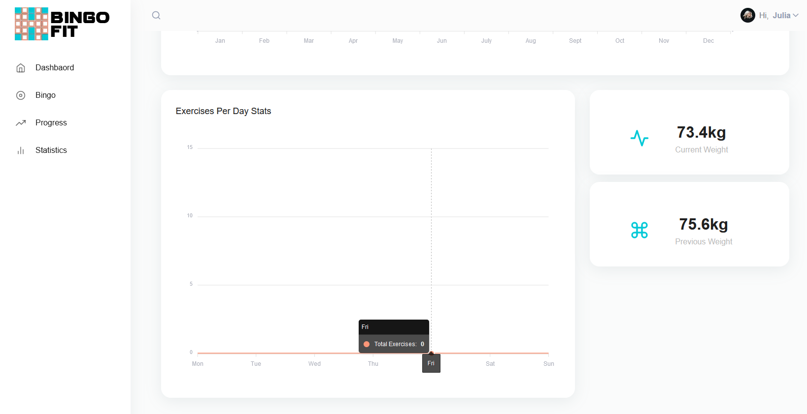

# Bingo Fit

A gamified fitness app, using the style of a popular traditional game in western culture - Bingo!

## Getting started

### Installing dependencies
```
cd skeleton
npm i
```

### Seed the database
```
npx prisma db seed
```

### Edit the database
```
npx prisma studio
```

### Run the app
```
npm run dev
```
The app will be served at <http://localhost:3000/>.


## Description & screenshots

Easy to read, modular homepage pertaining information about the user.


Bingo board with a free space and a leveling system.


Pop-up modal of the exercise and a simple timer system.


Tracks your exercise and calorie progress over time.
